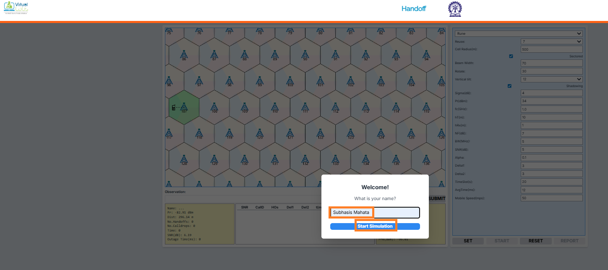
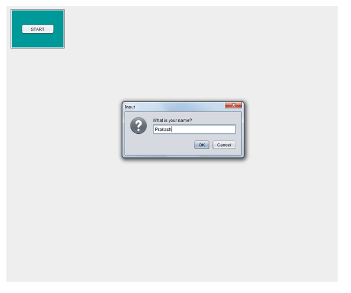
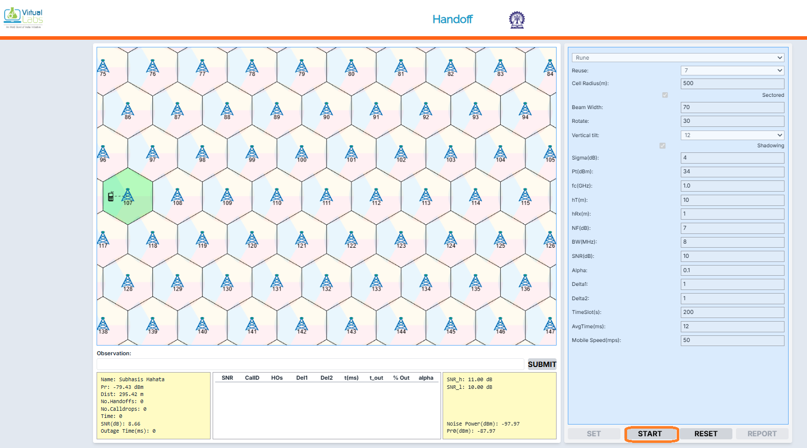
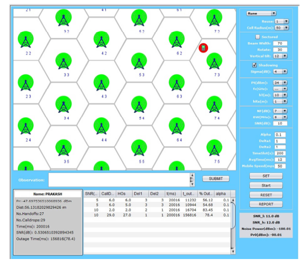
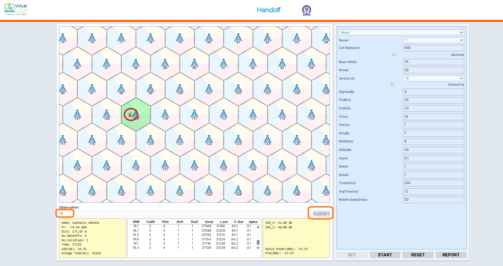
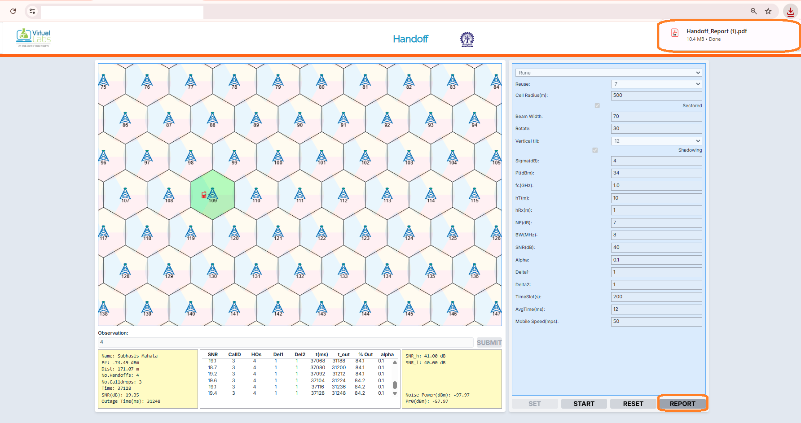
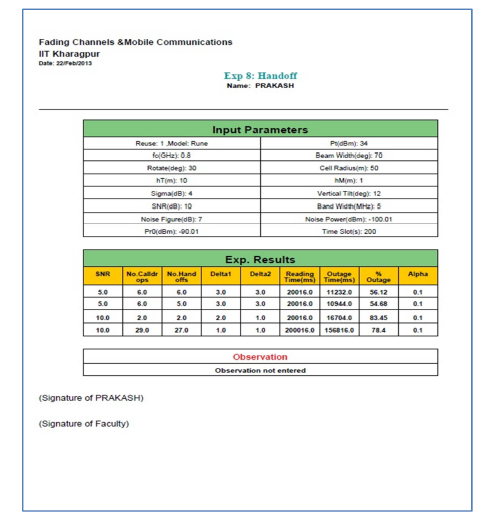

## Procedure

Follow the instructions given below to perform the experiments:-

* Step1: Click on START button to start experiment.

   

      
      

* Step2: Enter your name then click OK button.

    

      
      

* Step3: Select the parameters (e.g.: Reuse, Environment, Beamwidth, Carrier frequency etc.)

   

      
      

* Step4: Click on START button and observe No. of Call Drops and No. of Handoffs.

    

      
      

* Step5: Enter your observation in the OBSERVATION box and Click on SUBMIT button.

* Step6: Finally, click on REPORT to generate PDF report of the experiment.

    

      
      

* Step7: After PDF report generation you will get following message.

   

      
      

* Step8: PDF report will appear like this.

    

      
      

* Step9: To redo experiment click on RESET button.

    
