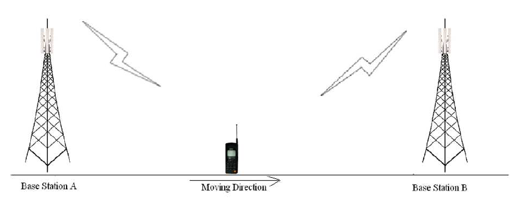

## Theory
**Introduction:**  
Consider the figure below Initially say the mobile M is quite close to the base station A and hence receives signal strength from A $P_(r_x)^A > P_(r_x)^B$ .As the mobile moves away from the base station. A and goes towards B then the signal strength from A keeps falling(pathloss increases).Let there be a minimum sensibility level $P_(r_x)^0$ for the mobile, i.e. if the signal from the B.S.to which the mobile is connected falls below $P_(r_x)^0$ then the call drops. In order to prevent call drop the mobile monitors receive signal strength from the neighboring 3-6 B.S.. These neighboring 3-6 B.S. also monitor Rx signal strength from the M.S.

      
      

The mobile should get connected to B.S. which has the highest signal strength. However if the M.S.continuously attaches itself to the B.S. with instantaneous height signal strength then the h/o rate may very high in server condition.

Thus some hysten's condition is used for h. If $P_(r_x)^T$ (T= target B.S.) > $P_(r_x)^h$ higher h/o threshold and $bar(P_(r_x)^c)$ (c=current B.S.) < $P_(r_x)^h$ minimum h/o threshold the execute h/o to $B*S_T$ from $B*S_c$. Thus, it is threshold impeditive to study in part of the handoff process.

$$Delta_gamma= P_(r_x)^h - P_(r_x)^l$$

A successful handoff is one where the call gets from and continuous without call or in other words the h occurs before h/o $P_(r_x)^c$ becomes $ < P_(r_x)^0$. If $P_(r_x)^c < P_(r_x)^0$then call drop event occurs.

One would like to minimize the no of handoff events as well as minimize call drop probability. The experiment provides opportunity to study the inherent of these three parameter on h/o .

Further the averaging window for calculating $P_(r_x)^T$ and $P_(r_x)^c$ also plays a role in the process. In the experiment small scale fading is not considered and hence the averaging taken into account only shadowing.

The person conducting the experiment is expected to study the impact of these on h/0. He/She is encouraged to respect the experiment for several sets of values of these parameters these draw conclusion.

     
 
